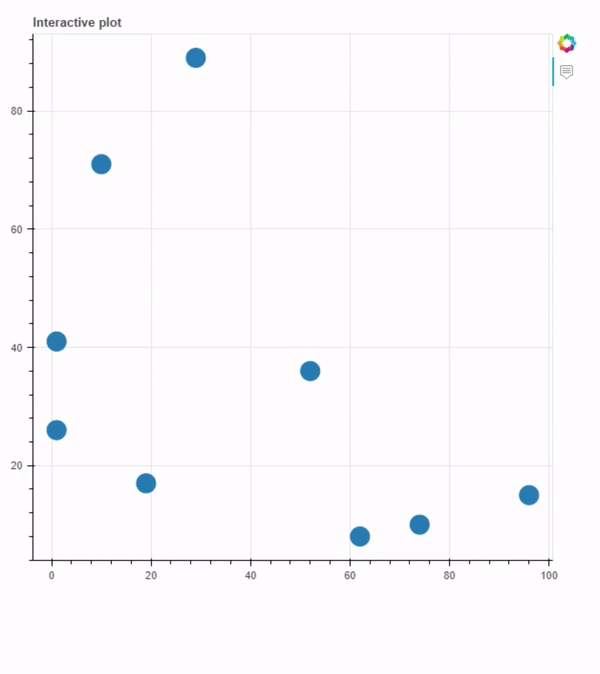

## Interactive plot for molecules

Script developed to plot any sort of molecular data with molecular compound images hovering in graph. 



## Libraries used

* [NumPy](https://numpy.org/) -  the fundamental package for array computing with Python

* [RDKit](https://www.rdkit.org/) - open source toolkit for cheminformatics.

* [bokeh](https://bokeh.org/) - a Python library for creating interactive visualizations for modern web browsers.

Libraries were used in a [Miniconda3](https://docs.conda.io/en/latest/miniconda.html) environment using python 3.6.13 

## Instalation

Miniconda3: [Installation](https://conda.io/projects/conda/en/latest/user-guide/install/index.html)

numpy
```
conda install -c anaconda numpy
```
RDKit
```
conda install -c rdkit rdkit
```
bokeh
```
conda install -c bokeh bokeh
```

## How to use

* Download the code and unzip it on the desirable directory

First, create the molecule images using:
```
python images.py
```
Then, to create the interactive plot use:
```
python interactive_plot.py
```

Your output will be stored at interactive_plot.html

## Observations

**The script at images.py has been elaborated using as references the following link and user:**

* [How would you convert a large sdf file of chemical compounds into individual files containing molecular images?](https://stackoverflow.com/questions/65823691/how-would-you-convert-a-large-sdf-file-of-chemical-compounds-into-individual-fil) - [Oliver Scott](https://stackoverflow.com/users/8720000/oliver-scott)

**The script at interactive_plot.py has been elaborated using as references the following link:**

* [Custom Tooltip](https://docs.bokeh.org/en/0.11.1/docs/user_guide/tools.html#custom-tooltip)

**The dataset was retrieved from:**

* [rdkit github](https://github.com/rdkit/rdkit/blob/master/Docs/Book/data/bzr.smi)

**This script will be updated.**

## Authorship

* Author: **Brenda Ferrari** ([brendaferrari](https://github.com/brendaferrari))

Social preview original photo by **Brenda Ferrari** ([brendaferrari](https://github.com/brendaferrari))